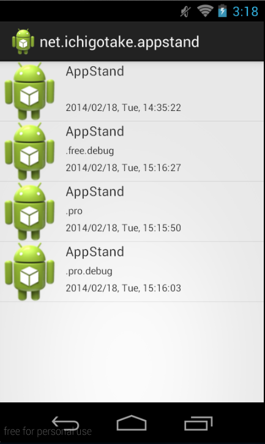

# AppStand

指定したパッケージに一致するアプリのうち、アクティビティの存在するランチャーを生成します。デバッグのお助けアプリ

## スクリーンショット

## 使い方

このレポジトリをダウンロードした上で

`gradle.properties` を編集してパッケージ名の接頭辞を設定してビルドしてください

先頭一致のパッケージ一覧を表示するランチャーアプリが作成できます

アプリ上で柔軟な設定が出来るようにはなっていないので、プロジェクトをダウンロードして `Filter` クラス周辺などを自由に書き換えてご利用ください

## 当アプリのbuild variants に関して

モジュールのbuild.gradleには build variants の設定があります。

ref: [AppStand/buid.gradle](AppStand/build.gradle)

スクリーンショットを取るためのものであり、デモアプリのためでありと、サンプルや動作確認のために利用するものです

## ライセンス

[Apache Lisence 2.0](http://www.apache.org/licenses/LICENSE-2.0)

